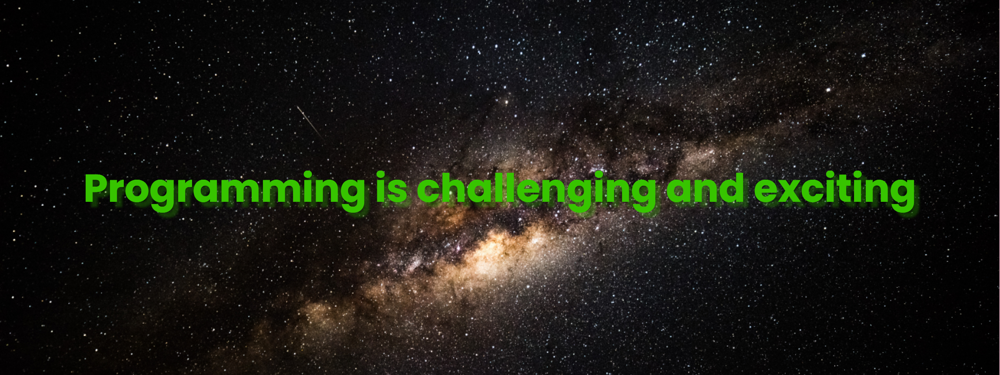

<!-- running svg -->
[](https://git.io/typing-svg)

<!-- github stat -->
[](https://github.com/anuraghazra/github-readme-stats)

<!-- github top language -->
[](https://github.com/anuraghazra/github-readme-stats)

<!-- Link for contact -->
<h3 align="left">Connect with me:</h3>
<p align="left">
<a href="your link" target="blank"></a>
<a href="your link" target="blank"></a>
<a href="your link" target="blank"></a>
<a href="your link" target="blank"></a>
</p>

<!-- Github streak -->
[](https://git.io/streak-stats)

<!-- trophy -->
[](https://github.com/ryo-ma/github-profile-trophy)


<!-- joke generator -->
<!-- Markdown -->


<!-- quote generator -->
[](https://github.com/piyushsuthar/github-readme-quotes)


<!-- collapsed section -->
<!-- <details>

<summary>Tips for collapsed sections</summary>

### You can add a header

You can add text within a collapsed section. 

You can add an image or a code block, too.

```ruby
   puts "Hello World"
```

</details> -->